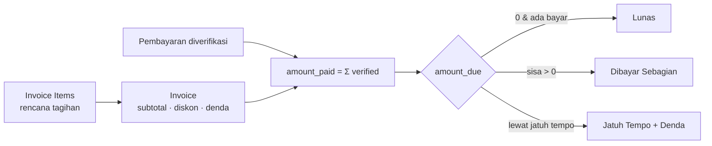

# Kost Management System

**Sistem manajemen kost end-to-end: setiap angka keuangan berasal dari transaksi yang tercatat — tagihan akurat, pembayaran terverifikasi, dan tidak ada data yang dihapus paksa.**

[](https://laravel.com)
[](https://www.php.net)
[](https://livewire.laravel.com)
[](https://tailwindcss.com)
[](https://www.mysql.com)
[](#pengujian)
[](#kontribusi--lisensi)

[Fitur](#fitur) · [Mulai Cepat](#mulai-cepat) · [Arsitektur](#arsitektur) · [Keamanan](#keamanan--validitas) · [Pengujian](#pengujian) · [Roadmap](#roadmap)

---

## Kenapa proyek ini

Kebanyakan sistem kost menyimpan status "Lunas" yang bisa diubah bebas. Aplikasi ini tidak. Di sini **item tagihan dan pembayaran terverifikasi adalah satu-satunya sumber kebenaran**:



- **Tidak ada angka ajaib.** Setiap `total`/`amount_due` dihitung ulang dari line item + pembayaran terverifikasi (bukan diketik manual).
- **Idempoten & aman.** Penagihan bulanan memakai constraint unik `(lease_id, billing_period)` + transaksi — dijalankan dua kali tidak menghasilkan tagihan ganda.
- **Tidak ada penghapusan histori.** Koreksi lewat **void**, **reversal/refund**, atau **adjustment** — bukan `DELETE`.

## Fitur

### Phase 1 — Fondasi

| Modul | Keterangan |
|---|---|
| Autentikasi | Breeze + Livewire (login, register, reset password, verifikasi email) |
| RBAC | `spatie/laravel-permission` — **66 permission**, 5 peran, owner bypass via `Gate::before` |
| Layout | Admin (sidebar + topbar), Tenant (mobile-first + bottom-nav), Publik |
| Komponen UI | `x-ui.*` reusable: button, card, badge, status-badge, alert, stat-card, table, input, select, textarea, money-input, file-upload, modal, confirm-dialog, tabs |
| Settings | Tabel `settings` + `SettingsService` (cache, cast) |
| Audit | `audit_logs` **append-only** (menolak update/delete) + `AuditService` |
| Uang | `bigInteger` rupiah (tanpa float) + helper `Money` (`Rp 1.500.000`) |

### Phase 2 — Properti & Kamar

| Modul | Keterangan |
|---|---|
| Properti → Gedung → Lantai | Hirarki lengkap, kode unik per properti |
| Tipe Kamar | Harga & deposit bawaan, kapasitas, fasilitas |
| Kamar | Nomor unik per properti, harga, deposit, status, foto |
| Fasilitas | Amenity per kamar & per tipe kamar |
| Peta Kamar | Visual per gedung/lantai, tile berwarna sesuai status + ringkasan hunian |
| Situs Publik | `/`, `/rooms`, `/rooms/{slug}` (hanya kamar **tersedia**), fasilitas, tentang, aturan, FAQ, kontak |

### Phase 3 — Penghuni & Kontrak

| Modul | Keterangan |
|---|---|
| Penghuni | Data pribadi, kontak darurat, kendaraan, dokumen (KTP/kontrak, private disk) |
| Undangan Akun | Buat penghuni → akun portal otomatis + undangan email (mail + database) |
| Aktivasi | **Signed URL** `/tenant/activate/{user}` → atur nama & kata sandi |
| Kontrak Sewa | `draft → active → terminated`, kode `LSE-YYYY-XXXX`, riwayat status |
| Aturan Kontrak | Cegah tumpang tindih kamar **dan** penghuni (transaksi + row lock) |
| Move-in / Move-out | Aktivasi → kamar `occupied` + deposit `held`; move-out → settlement deposit + kamar `available` |

### Phase 4 — Penagihan

| Modul | Keterangan |
|---|---|
| Tagihan | `invoices` + `invoice_items`, status `draft → issued → partially_paid → paid → overdue → void` |
| Kalkulasi | `BillingService`, `LateFeeCalculator` (harian / persen basis-point), `ProrationCalculator`, `InvoiceNumberGenerator` |
| Penagihan Berulang | `billing:generate-invoices` (idempoten per periode) + `GenerateInvoiceJob` |
| Jatuh Tempo & Denda | `billing:mark-overdue`, `billing:apply-late-fees` (deterministik, tidak menumpuk) |
| Portal Tenant | Daftar + detail tagihan (`/tenant/invoices`), widget "Tagihan Aktif" |
| Notifikasi | Tagihan terbit & jatuh tempo (mail + database) |

### Phase 5 — Pembayaran

| Modul | Keterangan |
|---|---|
| Metode Pembayaran | Transfer, Tunai, E-Wallet, QRIS (referensi data) |
| Pengajuan Pembayaran | Tenant pilih tagihan/metode + unggah bukti (private disk) → `pending` |
| Verifikasi | Admin **verify** → hitung ulang invoice → `paid` / `partially_paid`; **reject** + alasan |
| Refund / Cancel | Refund membalik kalkulasi invoice + audit; cancel oleh admin atau tenant |
| Notifikasi | `PaymentSubmitted` → admin, `PaymentVerified`/`PaymentRejected` → tenant |

### Fitur publik

- Katalog kamar tersedia dengan filter tipe + pencarian nomor, halaman detail kamar (foto, fasilitas, harga, aturan).
- Halaman statis: fasilitas, tentang, aturan, FAQ, kontak.

## Arsitektur

```mermaid
flowchart TB
    subgraph UI[Browser]
        B[Blade + Livewire 3 + Alpine + Tailwind]
    end
    subgraph APP[Laravel 13]
        MW[Middleware: auth, active, role, can]
        LW[Livewire Components]
        SVC[Services: BillingService · PaymentService<br/>LeaseService · TenantService · DepositService<br/>OccupancyService · SettingsService · AuditService]
        POL[Policies & Gates]
    end
    subgraph DB[(MySQL 8)]
        LEDGER[(invoice_items + payments<br/>single source of truth)]
        CACHE[(invoices<br/>cached aggregate)]
    end
    B --> MW --> LW --> SVC --> DB
    SVC --> LEDGER --> CACHE
```

**Penomoran dokumen** memakai generator per tahun (`INV-YYYY-XXXX`, `LSE-YYYY-XXXX`) dengan pengecekan unik.

**Formula tagihan** (identik di kalkulasi, dashboard, dan portal):

```
subtotal        = Σ item (sewa, listrik, air, internet, parkir, other, deposit)
total_amount    = subtotal − diskon + denda + penyesuaian
amount_paid     = Σ pembayaran berstatus verified
amount_due      = max(0, total_amount − amount_paid)
```

## Mulai Cepat

### Persyaratan

| Tool | Versi |
|---|---|
| PHP | ^8.3 (`pdo_mysql`, `mbstring`, `zip`, `gd`, `intl`, `xml`, `fileinfo`) |
| Composer | ^2.10 |
| Node + npm | ^24 + ^11 |
| MySQL | 8.0 (Laragon membundel semuanya) |

### Instalasi (5 menit)

```bash
composer install
cp .env.example .env

# buat database kost_management di MySQL (utf8mb4_unicode_ci)
php artisan key:generate
php artisan migrate --seed

npm install
npm run build

php artisan serve
```

Buka `http://127.0.0.1:8000` dan masuk dengan akun demo di bawah.

> Windows + Laragon? Aktifkan virtual host agar app disajikan dari folder `public`
> (`http://kostmanagement.test`) — lihat catatan Laragon di bawah. Jangan akses lewat
> sub-path seperti `/KostManagement/public` (Livewire memakai URL root-relatif).

### Akun Demo

| Email | Password | Peran |
|---|---|---|
| `owner@kostmanagement.test` | `password` | Owner (akses penuh) |
| `admin@kostmanagement.test` | `password` | Admin operasional |
| `finance@kostmanagement.test` | `password` | Keuangan |
| `technician@kostmanagement.test` | `password` | Teknisi |
| `tenant@kostmanagement.test` | `password` | Penghuni |

> Kata sandi mengikuti `KOST_DEV_PASSWORD` (default `password`). Seeder demo hanya berjalan di
> lingkungan `local`/`testing`.

Seeder membuat **Kost Mawar** (2 gedung, 3 lantai, 3 tipe, 11 fasilitas, 30 kamar), penghuni
`tenant@kostmanagement.test` dengan **kontrak aktif** (kamar `occupied`, deposit `held`), invoice
terbit, dan satu pembayaran menunggu verifikasi.

### Tur 2 menit (setelah login sebagai owner)

1. **Properti → Kamar** — lihat daftar + kartu, filter status, buka **Peta Kamar**.
2. **Penghuni** — buat penghuni baru → undangan aktivasi terkirim.
3. **Kontrak Sewa** — aktifkan kontrak (kamar jadi `occupied`, deposit dibuat).
4. **Tagihan** — terbitkan tagihan bulanan (otomatis) atau buat manual.
5. Masuk sebagai `tenant@kostmanagement.test` — **Tagihan → Bayar** → unggah bukti.
6. Kembali ke admin **Pembayaran** → **Verifikasi** → invoice menjadi **Lunas**.

### Catatan Laragon

Proyek berada di `C:\laragon\www\KostManagement`. Laragon memetakan folder Laravel ke `public/`:

- Akses di **`http://kostmanagement.test`** dengan `APP_URL=http://kostmanagement.test`.
- Bila belum resolve: Laragon → **Stop All** → **Start All** (regenerasi `auto.KostManagement.test.conf`
  + entri hosts), lalu mulai ulang.

## Struktur Proyek

```
app/Enums/                      # status bisnis (Room, Lease, Invoice, Payment, ...)
app/Services/                   # BillingService, PaymentService, LeaseService, ...
app/Jobs/                       # GenerateInvoiceJob
app/Console/Commands/           # billing:generate-invoices, mark-overdue, apply-late-fees
app/Events + Listeners + Notifications/
app/Livewire/Admin/{Property,Building,Floor,RoomType,Amenity,Room,Tenant,Lease,Invoice,Payment,PaymentMethod}
app/Livewire/Tenant/{Auth,Payment}
app/Http/Controllers/           # Public, Tenant, Admin
resources/views/{components/ui,layouts,livewire,public,tenant,partials}
```

Rute utama:
`/` · `/rooms` · `/admin/{properties,buildings,floors,room-types,amenities,rooms,tenants,leases,invoices,payments,payment-methods}` ·
`/tenant/{dashboard,lease,invoices,payments,notifications}`.

## Keamanan & Validitas

- Session auth + CSRF, password di-hash, **rate-limit login** (5/menit per email+IP).
- **RBAC granular** (66 permission) di tiga lapis: middleware `role:`/`can:`, `Gate`, dan cek ulang di dalam aksi.
- **Akun nonaktif otomatis ditolak** (`EnsureUserIsActive`).
- **Bukti & dokumen sensitif** disimpan di **private disk** dan hanya diunduh lewat endpoint ber-authorize (admin `payment.view` / tenant pemilik).
- **Audit trail append-only** untuk setiap perubahan penting (lease, invoice, payment, deposit).
- Validasi di frontend *dan* backend; error teknis tidak diekspos ke pengguna (`X-Request-ID` untuk tracing).
- Aturan integritas: kamar tidak boleh punya dua kontrak aktif yang tumpang tindih, tidak ada tagihan ganda per periode, `amount_paid` hanya dari pembayaran terverifikasi, tidak ada hard-delete data keuangan.

## Pengujian

```bash
php artisan test
php artisan test tests/Feature/Payment            # fokus alur pembayaran
vendor/bin/pint --test                            # gaya kode
```

**156 test hijau** meliputi: kalkulasi tagihan (diskon/denda/prorata), **idempotensi penagihan
bulanan** (2× jalan ⇒ 1 invoice), verifikasi pembayaran (lunas/sebagian/lebih bayar), refund,
isolasi data antar-tenant, otorisasi per peran, dan smoke-render seluruh halaman admin/tenant/publik.

## Build & Deploy

```bash
npm run build            # produksi → public/build
php artisan storage:link # symlink file publik (foto kamar, logo)
```

### Scheduler (penagihan & denda)

```bash
php artisan schedule:list
# generate tagihan tgl 1; mark-overdue & apply-late-fees harian
```

Di Windows/Laragon, jalankan scheduler tiap menit:

```powershell
schtasks /create /tn "KostManagement Scheduler" /tr "powershell -NoProfile -Command cd C:\laragon\www\KostManagement; php artisan schedule:run" /sc minute /mo 1
```

### Produksi

`APP_KEY`, `config:cache`, `route:cache`, `view:cache`, queue worker (`queue:work`), scheduler,
HTTPS, dan backup database — detail lengkap menyusul di **Phase 10**.

## Roadmap

- [x] Phase 0 — Arsitektur & perencanaan
- [x] Phase 1 — Fondasi (auth, RBAC, layout, komponen, settings, audit)
- [x] Phase 2 — Properti & Kamar (peta kamar + situs publik)
- [x] Phase 3 — Penghuni & Kontrak (undangan, move-in/out, deposit)
- [x] Phase 4 — Penagihan (kalkulasi, penagihan berulang, denda, scheduler)
- [x] Phase 5 — Pembayaran (bukti, verifikasi, refund, notifikasi)
- [ ] Phase 6 — Maintenance (tiket, prioritas, penugasan, SLA)
- [ ] Phase 7 — Pengumuman & Notifikasi (targeting, reminder otomatis)
- [ ] Phase 8 — Pengeluaran & Laporan (dashboard keuangan/hunian, ekspor CSV/XLSX/PDF)
- [ ] Phase 9 — Keamanan, Audit & Optimasi (IDOR review, N+1, caching, private file)
- [ ] Phase 10 — Pengujian & Kesiapan Produksi (backup, monitoring, deployment)

## Kontribusi & Lisensi

Pull request dipersilakan — jalankan `php artisan test` dan `vendor/bin/pint` sebelum submit.

Lisensi **MIT**. UI dibangun dari nol dengan Tailwind CSS + Livewire.
